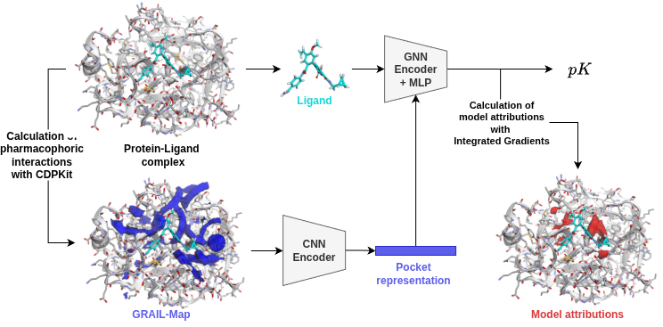

## GRAPE: Grids of Pharmacophore Interaction Fields for Affinity Prediction



**General information**

This is the official implementation of the GRAPE model for affinity prediction.
You can find the preprint on [arxiv]().
The pretrained model is available via [figshare]().

This project was developed with the following system specifications:
- **GPU:** NVIDIA GeForce 4090 RTX with 24 GB GDDR6X (recommended for model inference and training).
- **CPU:** AMD EPYC 7713 64-Core Processor (used for data preprocessing and pharmacophore alignment).
- **OS:** Rocky Linux (v9.4).

If you use this code or the model in your research, please cite our paper:

```bibtex
    tba
```

**Installation**

1. **Install Mamba and create a new environment:**

    ```bash
    mamba create -n grape python==3.11.13
    mamba activate grape
    ```

2. **Navigate to the `grape` folder.**

3. **If you have a GPU available, install the CUDA version of pytorch:**

    ```
    pip install torch==2.7.1 --index-url https://download.pytorch.org/whl/cu128
    ```
    Pytorch 2.7 also works with CUDA 12.6 and 12.9.
    Make sure to specify a CUDA version that is compatible with your hardware.
    To install the CPU-version, you can skip this step.
    Please note that MacOS only supports the CPU version of pytorch.

4. **Now install the GRAPE package and all other dependencies:**

    ```bash
    pip install -e .
    ```

5. **Download trained model from figshare:**

    Download the trained model from [figshare]() and place it into the `trained_model` folder. 
    
You are now all set for inference. For reproduction of the results as presented in the paper, you will additionally have to preprocess the PDBBind dataset, as described in the following.

6. **PDBBind v.2020 preprocessing**

    Due to licencing reasons, we cannot provide you with the preprocessed PDBBind dataset. You can obtain it as follows.
    Visit the download section of the official [PDBBind](https://www.pdbbind-plus.org.cn/download) homepage, where you will be prompted to create an account. 
    Scroll down to the PDBBind v2020 table and download the following files:
        `1. Index files of PDBbind`, `2. Protein-ligand complexes: The general set minus refined set`, and `3. Protein-ligand complexes: The refined set`.
    Place the respective zip-files into the folder `<dir>/data/PDBbind_2020` and untar them. Replace `<dir>` with the path to the root folder on your system. 

    ```
    tar -xvf PDBbind_v2020_plain_text_index.tar.gz
    tar -xvf PDBbind_v2020_refined.tar.gz
    tar -xvf PDBbind_v2020_other_PL.tar.gz
    ```
    
    The `data_preprocessing` folder contains a Python script to calculate GRAIL maps from the PDBBind entries. The script has a couple of options, but for reproduction of the results, you should use the default settings. Note that you can increase the number of CPU workers for faster processing with the -w flag.

    ```
    python <dir>/data_preprocessing/calc_grails_pdb_bind.py -d <dir>/data/PDBBind_2020/refined-set -o <dir> /data/PDBBind_2020/refined-set-GRAIL -w 4
    ```

    and 

    ```
    python <dir>/data_preprocessing/calc_grails_pdb_bind.py -d <dir>/data/PDBBind_2020/v2020-other-PL -o <dir> /data/PDBBind_2020/v2020-other-PL-GRAIL
    ```

    Pytorch geometric datasets work internally with a `raw` folder for unprocessed data and a `processed` folder for the processed pytorch tensors. 
    Create the `raw` folder with the provided script:

    ```
    python <dir>/data_preprocessing/create_raw_folder.py -d <dir>/data/PDBBind_2020
    ```

    The last thing we need are the binding affinites, which are provided in the PDBBind index file. 
    Execute the following script to create a cleaned up csv file for further use:

    ```
    python <dir>/data_preprocessing/index_file_processing.py -d <dir>/data/PDBBind_2020
    ```

    Now you are all set for training GRAPE models on the PDBBind dataset and reproduction of the paper results. 

**Reproduction of paper results and interactive attribution exploration**

We provide you with two notebooks. 
Running the cells in `<dir>/notebook/test_results.ipynb` will reproduce the results as presented in the paper.
We have further implemented an interactive app with py3dmol to explore GRAIL maps and model attributions, this can be found in the notebook `<dir>/notebook/model_attributions.ipynb`.

**Model training**

To train the GRAPE model yourself after PDBBind processing, run the following script:

```
python <dir>/scripts/training.py --config <dir>/scripts/config.yaml
```

This will create a logs folder in your root directory, where you will find the model together with the respective tensorboard logs.

