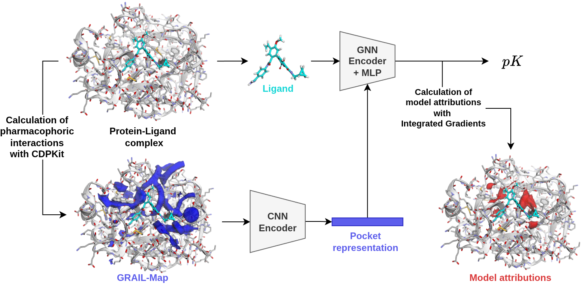

## GRIPHIN: Grids of Pharmacophore Interaction Fields for Affinity Prediction



**General information**

This is the official implementation of the GRIPHIN model for affinity prediction.
You will find the preprint soon on [ChemRxiv](https://chemrxiv.org/engage/chemrxiv/article-details/68e37981dfd0d042d1276d40).
The pretrained model is available via [figshare](https://figshare.com/articles/journal_contribution/GRIPHIN_Grids_of_Pharmacophore_Interaction_Fields_for_Affinity_Prediction_-_Trained_model_and_preprocessed_data/30272203).

This project was developed with the following system specifications:
- **GPU:** NVIDIA GeForce 4090 RTX with 24 GB GDDR6X (recommended for model inference and training).
- **CPU:** AMD EPYC 7713 64-Core Processor (used for data preprocessing and pharmacophore alignment).
- **OS:** Rocky Linux (v9.4).

If you use this code or the model in your research, please cite our paper:

```bibtex
    tba
```

**Installation**

1. **Install Mamba and create a new environment:**

    ```bash
    mamba create -n griphin python==3.11.13
    mamba activate griphin
    ```

2. **Clone the repo, navigate to the `GRIPHIN` folder and store the path to the working directory.**

    ```
    cd GRIPHIN
    export DIR=$PWD
    ```

3. **If you have a GPU available, install the CUDA version of pytorch:**

    ```
    pip install torch==2.7.1 --index-url https://download.pytorch.org/whl/cu128
    ```
    Pytorch 2.7 also works with CUDA 12.6 and 12.9.
    Make sure to specify a CUDA version that is compatible with your hardware.
    To install the CPU-version, you can skip this step.
    Please note that MacOS only supports the CPU version of pytorch.

4. **Now install the GRIPHIN package and all other dependencies:**

    ```bash
    pip install -e .
    ```

5. **Download trained model from figshare:**

    There are three files you can download from the provided [figshare](https://figshare.com/articles/journal_contribution/GRIPHIN_Grids_of_Pharmacophore_Interaction_Fields_for_Affinity_Prediction_-_Trained_model_and_preprocessed_data/30272203) link.
    `griphin_model.tar.gz` contains the trained model that can be used for inference.
    `griphin_model_lppdb.tar.gz` contains a model that was trained on the LP-PDBBind split.
    It it needed for reproduction of the paper results, but since it was trained on less data, we do not recommend it for inference.
    `data_lp.tar.gz` contains the preprocessed test dataset as provided by the LP-PDBBind study.
    Place the downloaded files into the `GRIPHIN` root directory. 
    Untaring will create a `trained_models` folder containing the trained models and add the LP-PDBBind test sets into the `data` folder:

    ```
    tar -xvf griphin_model.tar.gz 
    tar -xvf griphin_model_lppdb.tar.gz
    tar -xvf data_lp.tar.gz
    ```

For reproduction of the results as presented in the paper, you will additionally have to preprocess the PDBBind dataset, as described in the following.
If you are simply interested in using the model for inference, you can skip this step.

6. **PDBBind v.2020 preprocessing**

    Due to licencing reasons, we cannot provide you with the preprocessed PDBBind dataset. You can obtain it as follows.
    Visit the download section of the official [PDBBind](https://www.pdbbind-plus.org.cn/download) homepage, where you will be prompted to create an account. 
    Scroll down to the PDBBind v2020 table and download the following files:
        `1. Index files of PDBbind`, `2. Protein-ligand complexes: The general set minus refined set`, and `3. Protein-ligand complexes: The refined set`.
    Place the respective tar-files into the folder `data/PDBbind_2020` and untar them.

    ```
    tar -xvf data/PDBbind_2020/PDBbind_v2020_plain_text_index.tar.gz -C data/PDBbind_2020
    tar -xvf data/PDBbind_2020/PDBbind_v2020_refined.tar.gz -C data/PDBbind_2020
    tar -xvf data/PDBbind_2020/PDBbind_v2020_other_PL.tar.gz -C data/PDBbind_2020
    ```
    
    The `data_preprocessing` folder contains a Python script to calculate GRAIL maps from the PDBBind entries. The script has a couple of options, but for reproduction of the results, you should use the default settings. Note that you can increase the number of CPU workers for faster processing with the -w flag.

    ```
    python $DIR/data_preprocessing/calc_grails_pdb_bind.py -d $DIR/data/PDBbind_2020/refined-set -o $DIR/data/PDBbind_2020/refined-set-GRAIL -w 4
    ```

    and 

    ```
    python $DIR/data_preprocessing/calc_grails_pdb_bind.py -d $DIR/data/PDBbind_2020/v2020-other-PL -o $DIR/data/PDBbind_2020/v2020-other-PL-GRAIL -w 4
    ```

    Pytorch geometric datasets work internally with a `raw` folder for unprocessed data and a `processed` folder for the processed pytorch tensors. 
    Create the `raw` folder with the provided script:

    ```
    python $DIR/data_preprocessing/create_raw_folder.py -d $DIR/data/PDBbind_2020
    ```

    The last thing we need are the binding affinites, which are provided in the PDBBind index file. 
    Execute the following script to create a cleaned up csv file for further use:

    ```
    python $DIR/data_preprocessing/index_file_processing.py -d $DIR/data/PDBbind_2020
    ```

    Now you are all set for training GRIPHIN models on the PDBBind dataset and reproduction of the paper results. 

**Reproduction of paper results and interactive attribution exploration**

We provide you with two notebooks. 
Running the cells in `notebook/test_results.ipynb` will reproduce the results as presented in the paper.
We have further implemented an interactive app with py3dmol to explore GRAIL maps and model attributions, this can be found in the notebook `notebook/model_attributions.ipynb`.

**Model training**

To train the GRIPHIN model yourself after PDBBind processing, run the following script:

```
python $DIR/scripts/training.py --config $DIR/scripts/config.yaml
```

This will create a logs folder in your root directory, where you will find the model together with the respective tensorboard logs.
